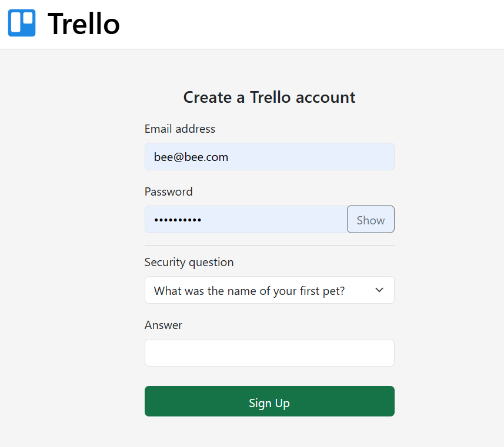
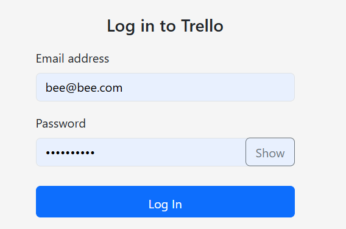
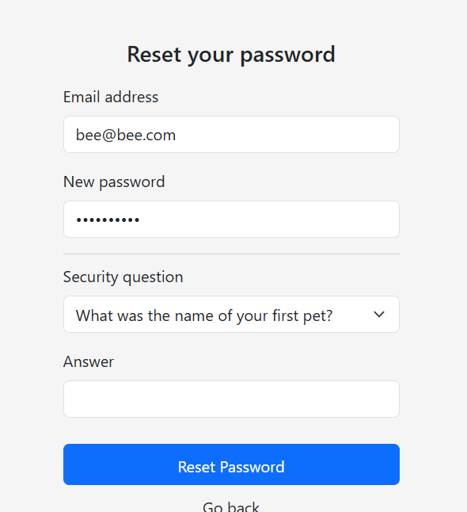
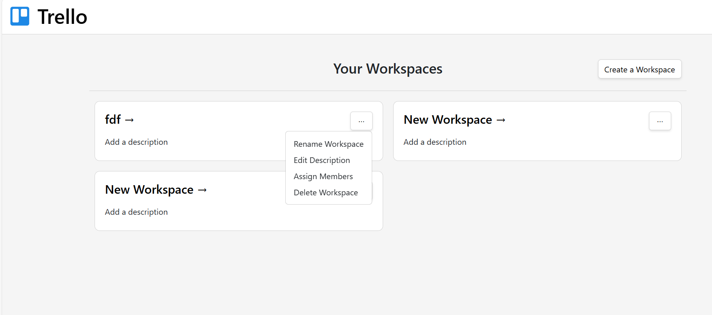
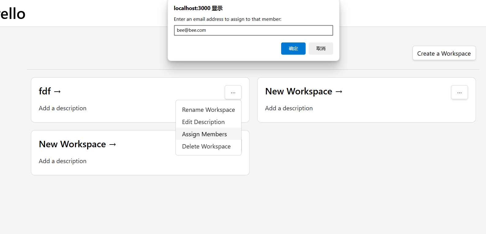
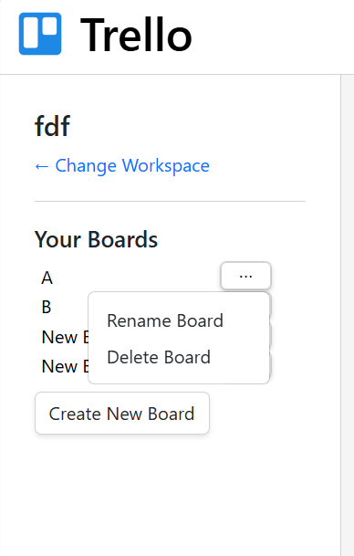
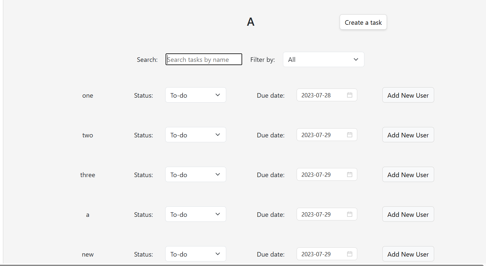

# Trello Application

This application allows users to create and manage workspaces and boards. 

## Getting started

To run this application in development: 

1. Clone the repository
2. Install npm and run the frontend ("npm start") in the trello-frontend directory
3. Connect to Dal VPN
4. Start the backend (run TrelloBackendApplication.java)

## Features

### Create an account

To create an account, enter an email and password and answer a security question of your choice. 

Passwords must be at least eight characters and contain at least one uppercase character, lowercase character, number, and special character.

### Log in 

Enter a valid email and password to log in. 

### Reset password

Under the log in form, click "Forgot your password?" Use the information you provided when signing up to change your password.

### Authorization

Trying to access the website's pages while not logged in will redirect you to the sign up/log in page. 

### Workspaces and boards

On the home page, users can create and manage workspaces (Rename Workspace, Edit Description, Assign Members, Delete Workspace).

To assign a workspace, click "Assign Members" and enter the email of another user. This user will now have access to your workspace. 

Click on the name of a workspace to go to the page for that workspace. 

Within a workspace, you can create and manage boards (Rename Board, Delete Board). 

Within a board, you can create and manage tasks. 

Workspaces and boards are connected to a database and associated with your account. 

## Group Members

This project was made by Jesse Guzman, Jingyi Yang, Yixin Zhou, Madison Hubley, and Ram Tejesh Reddy Maddi.
